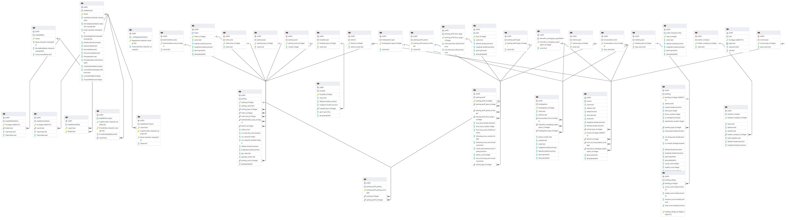
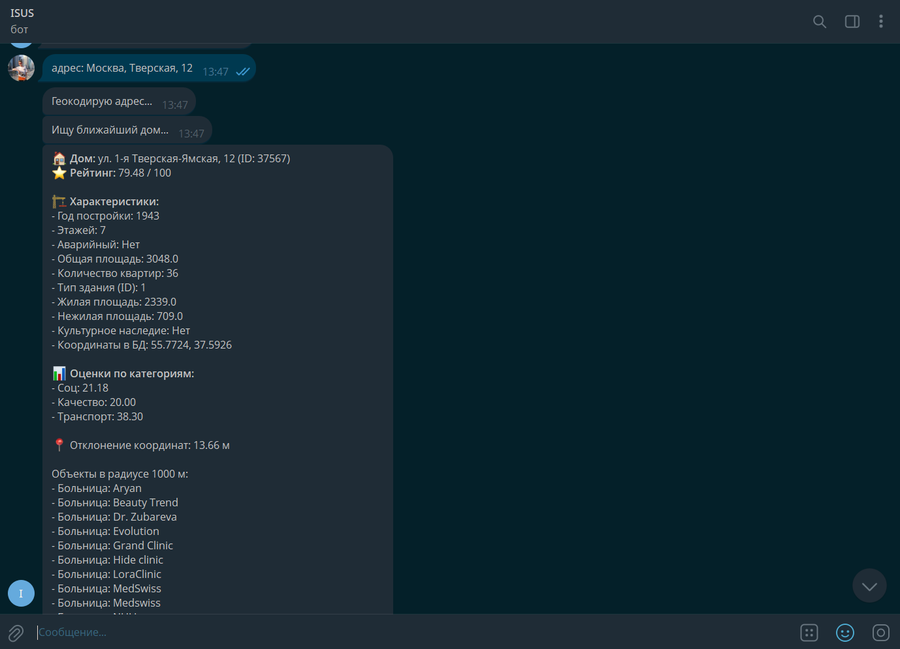
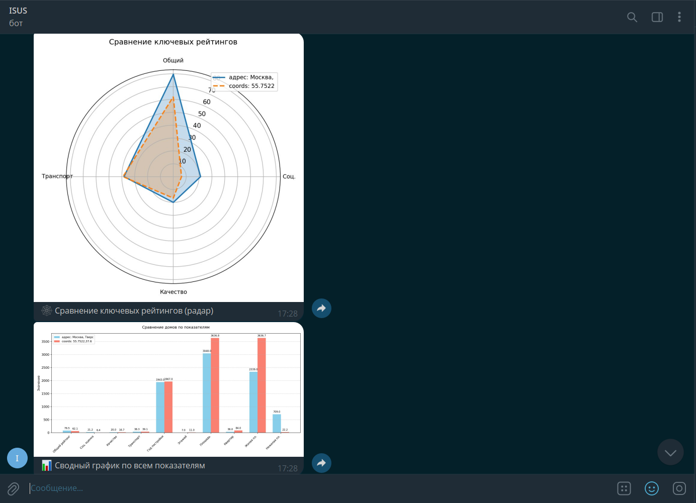
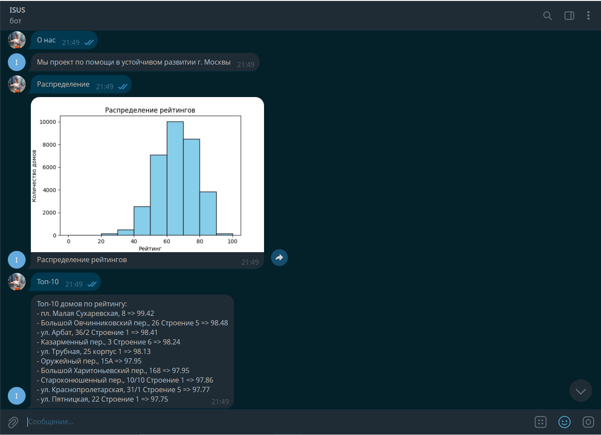

# Moscow Real Estate Analytics

## Описание проекта

Проект посвящён оценке жилой недвижимости в Москве.

В его основе - система рейтинга, которая рассчитывает итоговую оценку дома по трём группам факторов: социальной инфраструктуре, качеству самого здания и транспортной доступности. Для этого используются данные о жилых объектах, координатах и городской инфраструктуре, а также расчёт расстояний до школ, больниц, парков, метро, остановок, парковок и других объектов.

Основная идея заключается в том, чтобы не просто выводить информацию по дому, а дать возможность сравнивать объекты между собой по понятным критериям. Telegram-бот в этом проекте выступает как интерфейс: через него можно найти дом по адресу или координатам, посмотреть его рейтинг, детализацию по категориям, ближайшую инфраструктуру и результаты сравнения с другими объектами.

---

## Аналитические возможности

Поиск дома по адресу или координатам  
Расчёт рейтинга недвижимости от 0 до 100  
Детализация оценки по категориям   
Транспортная доступность  
Вывод топ-10 объектов по рейтингу  
Анализ распределения рейтингов  
Сравнение домов с визуализацией  
Сохранение истории запросов пользователей

---

## Алгоритм расчёта рейтинга

**Максимум - 100 баллов.**

**1. Социальная инфраструктура (макс. 30 баллов)**  
1.1. Образование (школы, сады) - ≤ 500 м линейное затухание (макс. 10 баллов)  
1.2. Медицина (аптеки, поликлиники, больницы) - ≤ 500 м линейное затухание (макс. 10 баллов)  
1.3. Парки - ≤ 1000 м линейное затухание (макс. 5 баллов)  
1.4. Диверсификация (макс. 5 баллов)  
4 категории поблизости - +5 баллов  
3 категории - +3 балла
1–2 категории - +1 балл

**2. Качество недвижимости (макс. 30 баллов)**  
2.1. Аварийность - 10 или 0 баллов  
2.2. Этажность - 3–9 эт. = 10, иначе линейное снижение (макс. 10 баллов)  
2.3. Возраст - 0–5 лет = 10, далее линейное снижение до 0 (макс. 10 баллов)  

**3. Транспортная доступность (макс. 40 баллов)**  
3.1. Метро - ≤ 2400 м линейное затухание (макс. 10 баллов)  
3.2. Остановки - учёт плотности и расстояния (макс. 10 баллов)  
3.3. Центр города - ≤ 2 км = 10, ≥ 18 км = 0, иначе линейное затухание (макс. 10 баллов)  
3.4. Парковки - ≤ 500 м линейное затухание + ёмкость (макс. 10 баллов)  

---

## Технологический стек

Python 3.11  
Aiogram  
PostgreSQL  
PostGIS  
OpenStreetMap Nominatim  
Matplotlib  

---

## Архитектура данных

В проекте используется PostgreSQL с расширением PostGIS для работы с координатами и пространственными запросами.



---
## Структура репозитория

`main.py` - основной код Telegram-бота и логика взаимодействия с пользователем

`sql/` - SQL-скрипт для расчёта рейтинга объектов

`docs/` - диаграмма базы данных, скриншоты и материалы с визуализацией работы системы

`requirements.txt` - зависимости проекта

---

## Запуск проекта

Для запуска требуется Python 3.11+, PostgreSQL с расширением PostGIS и настроенное окружение с переменными среды.

Установка зависимостей:

```bash
pip install -r requirements.txt
```

Запуск:

```bash
python main.py
```

Для полноценной работы проекта требуется база данных с объектами недвижимости и инфраструктурой.

---

## Концепция развития проекта

Помимо Telegram-бота, в рамках проекта прорабатывался более широкий пользовательский сценарий:

Интерактивная карта Москвы с отображением домов и районов  
Визуализация рейтингов с использованием цветовой шкалы  
Карточка объекта с подробной информацией и разложением рейтинга  
Фильтры для управления влиянием различных факторов  
Сравнение объектов недвижимости  
Аналитические графики и отчёты  
Интеллектуальный помощник для ответов на вопросы пользователей  

---

## Примеры работы

Ответ бота  


Выбор объектов для сравнения  


Результат сравнения объектов  


Аналитика и визуализация  


Распределение и топ объектов  


Карта объектов  


---

## Особенности проекта  

геопространственный анализ объектов недвижимости и городской инфраструктуры;  
использование PostgreSQL + PostGIS для пространственных запросов;  
собственная система скоринга с прозрачной логикой расчёта;  
объединение нескольких групп факторов в итоговую оценку;  
визуализация результатов и сравнение объектов;  
Telegram-бот как интерфейс доступа к аналитике.  

---

## Возможные улучшения

Формирование отчётов по каждому дому  
Интеграция LLM для обработки пользовательских запросов  
Разработка интеллектуального ассистента на основе собственного датасета  
Объяснение рейтинга и рекомендации пользователю  
Анализ текстовых отзывов об инфраструктуре  
Переход от API к собственной модели  
Разработка веб-интерфейса  
Расширение набора метрик  

---

## Моя роль

Проект выполнялся в команде, но аналитическая и data-часть в основном была на мне.

Я отвечал за структуру рейтинга, выбор факторов оценки, работу с данными по объектам недвижимости и инфраструктуре, проектирование логики расчёта расстояний и итогового скоринга, а также участвовал в построении базы данных. Кроме того, я реализовал Telegram-бота как интерфейс для доступа к результатам анализа.

Остальная часть команды в основном занималась веб-частью и картой.
